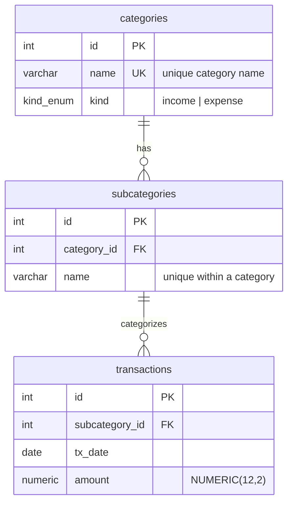

# Transactions — Database Schema Design

Design for normalizing the flat `transactions` table (see `transactions_sample.sql`)
into related `categories`, `subcategories`, and `transactions` tables.

Status: **design only — no DDL/migration implemented yet.**

## Background

The sample data uses a single denormalized table where every row repeats
`kind`, `category`, and `subcategory` as free-text strings:

```sql
transactions (kind, category, subcategory, tx_date, amount)
```

Two structural facts observed across all 193 sample rows drive the design:

1. **`kind` is a property of the category, not the transaction.** Every category
   is consistently either `income` or `expense` — never mixed. So `kind` belongs
   on the category.
2. **Each subcategory belongs to exactly one category.** No subcategory label
   appears under two different categories.

## Category hierarchy (from sample data)

12 categories, 41 subcategories.

| kind    | category                  | subcategories |
|---------|---------------------------|---------------|
| income  | Salary & Wages            | Primary Job, Freelance Gig, Bonus |
| income  | Other Income              | Interest Earned, Cashback Rewards |
| expense | Housing                   | Rent, Electricity, Water, Building Maintenance Fee |
| expense | Groceries                 | Supermarket, Bakery, Farmers Market |
| expense | Utilities & Subscriptions | Streaming Service, Mobile Plan, Home Internet, Cloud Storage |
| expense | Transportation            | Fuel, Parking, Car Wash, Public Transit Pass |
| expense | Fitness & Hobbies         | Gym Membership, Books & Games, Event Fee, Supplements, Sports Gear |
| expense | Pets                      | Pet Food, Grooming, Vet Visit, Toys & Accessories |
| expense | Debt Payments             | Car Loan, Student Loan, Credit Card |
| expense | Savings & Investments     | Index Fund, Emergency Fund, Retirement Account |
| expense | Clothing                  | Apparel, Shoes |
| expense | Miscellaneous             | Gifts, Bank Fees, Charity Donation, Online Courses, Other |

## Proposed schema



### Tables

- **categories** — `id` PK, `name` (unique), `kind` (income | expense, enum or
  CHECK constraint).
- **subcategories** — `id` PK, `category_id` FK → categories, `name`. Unique on
  `(category_id, name)`.
- **transactions** — `id` PK, `subcategory_id` FK → subcategories, `tx_date`,
  `amount`.

### Design notes

- **`kind` lives on `categories`**, not on transactions. A transaction's
  income/expense nature is derived by joining `transaction → subcategory →
  category`, so it can never become internally inconsistent the way three
  independent free-text columns can.
- **`transactions` references only `subcategory_id`.** Category and kind are
  reachable via join, so storing `category_id` on the transaction as well would
  be redundant and a source of drift.
- **Uniqueness:** `categories.name` unique; `subcategories(category_id, name)`
  unique — prevents duplicates within a category while allowing the same
  subcategory label under different categories if ever needed.
- **`amount`** is `NUMERIC(12,2)`, not float, to avoid money rounding errors.

## Decision: enum vs. lookup table for `kind`

We start with **`kind` as an enum / CHECK constraint on `categories`** — simplest
option for a fixed income/expense pair.

Promoting `kind` to a separate `kinds` lookup table later is a cheap, localized
migration, because `kind` lives on the 12-row `categories` table and not on the
large `transactions` table:

1. Create `kinds` table + seed `income` / `expense`.
2. Add `categories.kind_id` FK; backfill with one UPDATE over ~12 rows.
3. Drop `categories.kind`.

`transactions` is never touched. The only non-trivial cost is application-layer
(queries filtering on `kind`, ORM models) — identical regardless of which schema
we start from. So there is no reason to pay for the lookup table up front; add it
only if a third `kind` (e.g. "transfer") ever appears.
