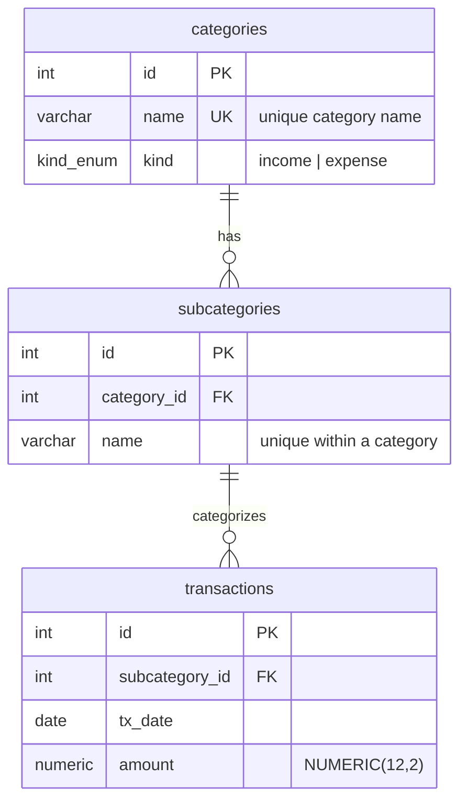
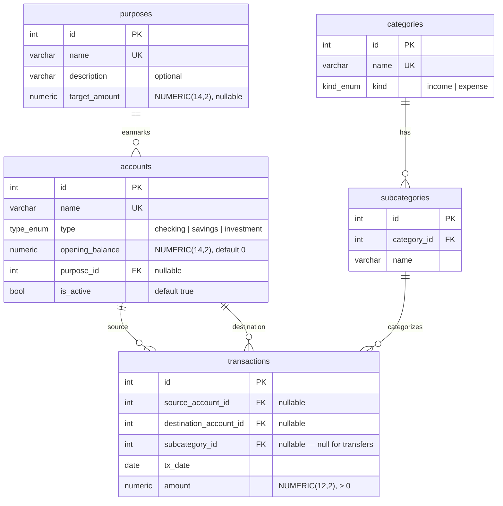
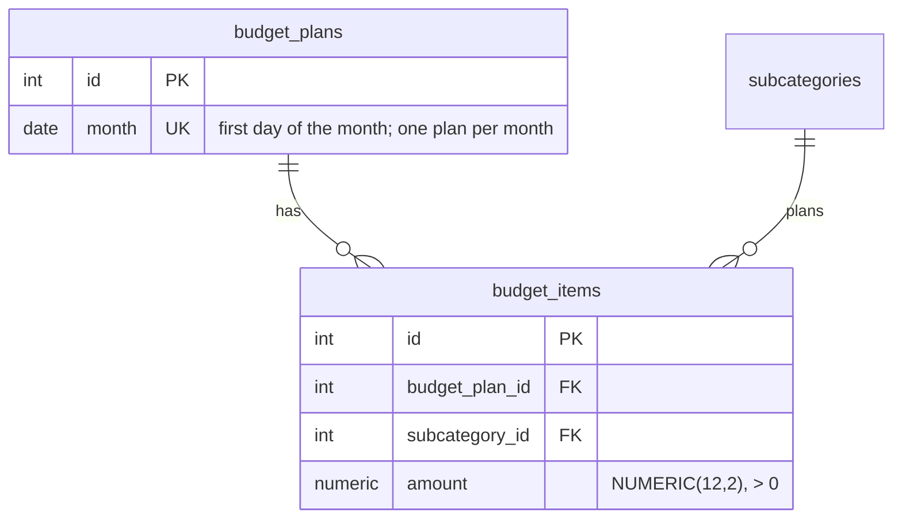

# Transactions — Database Schema Design

Design for normalizing the flat `transactions` table (see `transactions_sample.sql`)
into related `categories`, `subcategories`, and `transactions` tables.

Status: **v1, v2, v3 & v4 implemented** (models + migrations). v1 covers `categories`,
`subcategories`, `transactions`; v2 adds the `wallets` app (`accounts`,
`purposes`), transaction account legs, and transfers — see
["v2 — Accounts & transfers"](#v2--accounts--transfers); v3 adds **liabilities**
(debts as negative-balance accounts) — see ["v3 — Liabilities"](#v3--liabilities-debts);
v4 adds the `budgets` app (**monthly budget plans**) — see
["v4 — Budget plans"](#v4--budget-plans).

## Background

The sample data uses a single denormalized table where every row repeats
`kind`, `category`, and `subcategory` as free-text strings:

```sql
transactions (kind, category, subcategory, tx_date, amount)
```

Two structural facts observed across all 193 sample rows drive the design:

1. **`kind` is a property of the category, not the transaction.** Every category
   is consistently either `income` or `expense` — never mixed. So `kind` belongs
   on the category.
2. **Each subcategory belongs to exactly one category.** No subcategory label
   appears under two different categories.

## Category hierarchy (from sample data)

12 categories, 41 subcategories.

| kind    | category                  | subcategories |
|---------|---------------------------|---------------|
| income  | Salary & Wages            | Primary Job, Freelance Gig, Bonus |
| income  | Other Income              | Interest Earned, Cashback Rewards |
| expense | Housing                   | Rent, Electricity, Water, Building Maintenance Fee |
| expense | Groceries                 | Supermarket, Bakery, Farmers Market |
| expense | Utilities & Subscriptions | Streaming Service, Mobile Plan, Home Internet, Cloud Storage |
| expense | Transportation            | Fuel, Parking, Car Wash, Public Transit Pass |
| expense | Fitness & Hobbies         | Gym Membership, Books & Games, Event Fee, Supplements, Sports Gear |
| expense | Pets                      | Pet Food, Grooming, Vet Visit, Toys & Accessories |
| expense | Debt Payments             | Car Loan, Student Loan, Credit Card |
| expense | Savings & Investments     | Index Fund, Emergency Fund, Retirement Account |
| expense | Clothing                  | Apparel, Shoes |
| expense | Miscellaneous             | Gifts, Bank Fees, Charity Donation, Online Courses, Other |

## Proposed schema



### Tables

- **categories** — `id` PK, `name` (unique), `kind` (income | expense, enum or
  CHECK constraint).
- **subcategories** — `id` PK, `category_id` FK → categories, `name`. Unique on
  `(category_id, name)`.
- **transactions** — `id` PK, `subcategory_id` FK → subcategories, `tx_date`,
  `amount`.

### Design notes

- **`kind` lives on `categories`**, not on transactions. A transaction's
  income/expense nature is derived by joining `transaction → subcategory →
  category`, so it can never become internally inconsistent the way three
  independent free-text columns can.
- **`transactions` references only `subcategory_id`.** Category and kind are
  reachable via join, so storing `category_id` on the transaction as well would
  be redundant and a source of drift.
- **Uniqueness:** `categories.name` unique; `subcategories(category_id, name)`
  unique — prevents duplicates within a category while allowing the same
  subcategory label under different categories if ever needed.
- **`amount`** is `NUMERIC(12,2)`, not float, to avoid money rounding errors.

## Decision: enum vs. lookup table for `kind`

We start with **`kind` as an enum / CHECK constraint on `categories`** — simplest
option for a fixed income/expense pair.

Promoting `kind` to a separate `kinds` lookup table later is a cheap, localized
migration, because `kind` lives on the 12-row `categories` table and not on the
large `transactions` table:

1. Create `kinds` table + seed `income` / `expense`.
2. Add `categories.kind_id` FK; backfill with one UPDATE over ~12 rows.
3. Drop `categories.kind`.

`transactions` is never touched. The only non-trivial cost is application-layer
(queries filtering on `kind`, ORM models) — identical regardless of which schema
we start from. So there is no reason to pay for the lookup table up front; add it
only if a third `kind` (e.g. "transfer") ever appears.

---

# v2 — Accounts & transfers

Status: **implemented.** `wallets` app (`Account`, `Purpose`) with seed data;
`Transaction` extended with `source_account` / `destination_account` legs, nullable
`subcategory`, and the four CHECK constraints; existing rows backfilled and sample
transfers seeded. `Account.balance` is computed from the transaction legs.

v2 introduces **accounts** (bank, savings, investment) so we can track each
account's balance and the cash flow between them, and adds a third transaction
type — **transfer** — alongside income and expense. Accounts can also be earmarked
toward a **purpose** / savings goal (emergency fund, future home repair).

Accounts live in a **separate `wallets` app**, not in `transactions`. An account is
a *container of money* with its own lifecycle (balances, purposes, later holdings /
valuations), distinct from a transaction, which is a *movement event*. The
dependency runs one way — `transactions` depends on `wallets` (a `Transaction` has
FKs to `Account`); `wallets` never imports `transactions` (balances are computed
from reverse relations). `Category` / `Subcategory` stay in `transactions` — they
classify transactions and have no independent lifecycle.

## The core insight

The three transaction types differ by **how many of the user's own accounts they
touch**:

| Type     | Own account(s) touched                 | Counterparty              |
|----------|----------------------------------------|---------------------------|
| income   | one — money lands *in* an account      | external (employer, bank) |
| expense  | one — money leaves *from* an account   | external (merchant)       |
| transfer | two — leaves one, lands in another     | none — it's internal      |

This extends the v1 "derive, don't store" principle. In v1 `kind` is derived from
the transaction's category. In v2 the type is derived one level up — from **which
account legs are populated** — which naturally subsumes the income/expense split
*and* expresses transfers, something the category alone cannot.

## Proposed schema



### New table: `accounts`

- `id` PK
- `name` — unique
- `type` — `checking | savings | investment` (enum / CHECK constraint)
- `opening_balance` — `NUMERIC(14,2)`, default `0`
- `purpose_id` FK → purposes, **nullable**, `ON DELETE PROTECT` — the savings goal
  this account is earmarked toward (null for general-purpose accounts).
- `is_active` — bool, default `true` (soft-archive instead of delete)

`currency` is deliberately omitted — see [deferred](#deferred-not-in-v2).

### New table: `purposes`

An account's **purpose** is a savings goal / earmark — what a pot of money is *for*
(emergency fund, future home repair). This is a **separate taxonomy** from
transaction `categories`: a category classifies an income/expense *flow* and
carries `kind`; a purpose classifies what an *account* is for and has no
income/expense nature. They must not share a table.

- `id` PK
- `name` — unique
- `description` — optional free text
- `target_amount` — `NUMERIC(14,2)`, **nullable** — the amount being saved toward.
  Progress = `Σ(balance of accounts with this purpose) / target_amount`.

One purpose → many accounts (several accounts can sit under one goal, and the
earmarked total is the sum of their balances). `PROTECT` prevents deleting a
purpose that still has accounts attached.

Purposes replace the v1 workaround of modelling savings destinations as **expense**
subcategories (`Savings & Investments → Emergency Fund / Retirement Account`). In
v2, moving money into a savings account is a **transfer** (net worth unchanged) and
the earmark lives on the account's purpose — so that v1 expense category is largely
superseded. Cleanup of those subcategories can follow later.

### Changes to `transactions`

- Add `source_account_id` FK → accounts, **nullable**, `ON DELETE PROTECT` — the
  account money leaves.
- Add `destination_account_id` FK → accounts, **nullable**, `ON DELETE PROTECT` —
  the account money lands in.
- `subcategory_id` becomes **nullable** (null for transfers).
- `amount` stays a **positive magnitude**; direction is encoded by which leg is
  filled, never by the sign.

## Type is derived from the legs

No stored `type` column — no drift. The type is a pure function of the two legs:

| `source_account` | `destination_account` | derived type | `subcategory` |
|------------------|-----------------------|--------------|---------------|
| NULL             | SET                   | income       | required      |
| SET              | NULL                  | expense      | required      |
| SET              | SET                   | transfer     | NULL          |

External counterparties (employer, merchant) are represented by the **NULL leg** —
there is no need for an explicit "external" pseudo-account. The category describes
*what* an income/expense was; transfers carry no category.

## Where `kind` fits now

`categories.kind` stays as `income | expense`. It is no longer the source of truth
for a transaction's type — the account legs are. It is retained as a **validation
aid**: it drives the category picker and lets the app reject, e.g., an expense
category on an income-shaped transaction. Single source of truth for type = the
legs; `kind` only constrains *which* category is compatible.

## State & cash flow — derived, not cached

- **Account balance** =
  `opening_balance + Σ(amount where destination = acct) − Σ(amount where source = acct)`
- **Net worth** = sum of all account balances. Transfers net to zero automatically
  (they hit one `+` leg and one `−` leg).
- **Cash flow between accounts** = transfers filtered by `source` / `destination`.

Balances are **not** cached on `accounts`; they are computed with aggregates. A
denormalized cached balance is a later optimization if reporting gets slow — same
reasoning as the `kind` lookup-table deferral in v1.

## Constraints

DB-level `CHECK` / unique (single-table, structural):

1. Not both legs null: `source_account_id IS NOT NULL OR destination_account_id IS NOT NULL`.
2. No self-transfer: `source_account_id IS NULL OR source_account_id <> destination_account_id`.
3. `amount > 0`.
4. `subcategory` present **iff not a transfer** — i.e. `subcategory_id IS NULL`
   exactly when both legs are set.

Application-level (`Model.clean()` + serializer — cross-table, so a `CHECK` cannot
express them):

- Category compatibility: an income-shaped transaction requires a category whose
  `kind = income`; an expense-shaped one requires `kind = expense`.

## Migration path

`transactions` is altered but no existing row is invalidated:

1. Add the `accounts` model + migration; seed a small set of accounts.
2. Alter `transactions`: add `source_account_id` / `destination_account_id`, make
   `subcategory_id` nullable, add the four CHECK constraints.
3. **Backfill** existing rows via a data migration: no transfers exist yet, so
   every current row is income or expense. Using each row's
   `subcategory → category.kind`, set `destination_account_id` (income) or
   `source_account_id` (expense) to a default account. ~193 rows.

## Deferred (not in v2)

- **Investment valuation.** Investment accounts change value from *market
  movement*, not just cash flow. v2 treats them as cash-balance accounts (transfer
  money in; record gains as income). True holdings tracking — positions, prices,
  valuations over time — is a separate, much larger module, explicitly not built
  here.
- **Split transactions.** The two-leg model cannot split one payment across several
  categories (e.g. $60 groceries + $40 clothing in one purchase). That, plus
  multi-currency lots and proper investment accounting, is the trigger to migrate
  to a full double-entry **postings/ledger** table (2+ signed postings per
  transaction). Until such a need appears, the two-leg model is the sweet spot.
- **Currency.** Single-currency assumed. Adding `currency` to `accounts` (and
  handling cross-currency transfers with an exchange rate) waits until it's needed.

---

# v3 — Liabilities (debts)

Status: **implemented.** Adds a `liability` account type + `Account.is_liability`;
the net-worth report groups assets vs. liabilities; an `Interest` expense category
is seeded (migration `transactions/0007`).

v3 lets the app track debts — a mortgage, a loan, an overdue bill — alongside
assets. The insight is that **a debt is just an account whose balance is
negative** (the amount owed), and the existing two-leg transaction model already
expresses paying it down. No new tables and no changes to `transactions` were
needed; the accounts feature extends to cover it.

## The core insight

An asset holds money you have; a liability holds money you owe. The only
structural difference is the sign of the balance. So a debt is an `Account` with:

- `type = "liability"` — a fourth `Account.Type`, so reports and the UI can tell
  assets and liabilities apart. `Account.is_liability` derives from it.
- a **negative `opening_balance`** — the amount outstanding when tracking starts
  (e.g. a mortgage at `-300000.00`). `opening_balance` was already an unconstrained
  `DecimalField`, so negatives needed no schema change.

`Account.balance` (`opening_balance + Σincoming − Σoutgoing`) is unchanged and
stays negative until the debt is paid off, then trends to zero.

## How the money flows map (no new transaction shapes)

| Event | Modeled as | Effect on net worth |
|-------|------------|---------------------|
| Debt outstanding at tracking start | negative `opening_balance` | — |
| Pay **principal** | **transfer** cash account → liability | **neutral** (cash ↓, debt ↑ toward 0) |
| **Interest** charged | **expense** (source = cash account; `Interest` category) | **negative** (a real cost) |
| Incur a new **payable** (accrual, e.g. an overdue bill) | **expense** from the liability account | **negative** when incurred |
| Settle that payable later | **transfer** cash account → liability | **neutral** |

Paying down principal being net-worth-neutral is *correct*: it converts cash into
debt reduction, leaving net worth unchanged — only its composition changes.
Transfers already net to zero (v2), so this falls out for free.

## Net worth becomes assets − liabilities

`Account.balance` summed over all accounts now yields *true* net worth, because
liability balances are negative. `GET /api/v1/reports/net-worth/` groups the accounts
into `assets` / `liabilities` with subtotals, where
`net_worth = total_assets + total_liabilities` (the latter being a negative sum).

## Deferred (not in v3)

- **Split transactions.** A single real mortgage payment is principal + interest,
  which here requires two records (one transfer, one expense). This is the same
  split-transaction limitation deferred in v2 — the trigger for a full
  double-entry ledger if it ever becomes painful.
- **Interest accrual / amortization schedules.** Interest is recorded when it
  occurs, not projected from a rate and schedule. Amortization forecasting is out
  of scope.
- **Payoff targets.** Purposes carry a `target_amount` for savings goals; there is
  no analogous "payoff by" target on liabilities yet.

---

# v4 — Budget plans

Status: **implemented.** New `budgets` app (`BudgetPlan`, `BudgetItem`) exposed at
`GET/POST/PUT/PATCH/DELETE /api/v1/budget-plans/`. A plan holds one planned amount
per subcategory for a given month.

v4 lets the user set a **monthly budget**: for the current month, a planned amount
against each subcategory. Plans are stored and fetched from the budget-plans
endpoint. This is the *plan* side; comparing it to actual transactions
(plan-vs-actual reporting) is a natural follow-up but not part of v4.

## The core insight

A budget is planned amounts at the **same grain transactions are categorized** —
the subcategory. Budgeting per subcategory (rather than per category) means a plan
line joins directly to `Transaction.subcategory`, so plan-vs-actual is a plain
group-by, and category-level planned totals roll up for free (as the spending
report already does). A subcategory's `category.kind` says whether a line is
planned income or expense, so no separate kind is stored on the budget.

## Proposed schema



### New table: `budget_plans`

- `id` PK
- `month` — `DATE`, **unique**, normalized to the first day of the month. One plan
  per calendar month; the day component is collapsed to the 1st in the serializer
  so any day in the month resolves to that month's plan.

### New table: `budget_items`

- `id` PK
- `budget_plan_id` FK → budget_plans, `ON DELETE CASCADE` — items are owned by the
  plan and have no meaning without it.
- `subcategory_id` FK → subcategories, `ON DELETE PROTECT` — a subcategory that is
  referenced by a plan cannot be deleted out from under it.
- `amount` — `NUMERIC(12,2)`, a **positive magnitude** (same convention as
  `transactions.amount`; direction is implied by the subcategory's category kind).
- Unique on `(budget_plan_id, subcategory_id)` — at most one line per subcategory
  per plan.

## Constraints

DB-level `CHECK` / unique (single-table, structural):

1. `budget_plans.month` unique.
2. `budget_items(budget_plan_id, subcategory_id)` unique.
3. `amount > 0`.

Application-level (serializer):

- `month` normalized to the first of the month, with the uniqueness check run on
  the **normalized** value (not the raw day the request carried).
- No duplicate subcategory within a single submitted plan.

## API shape

- **Write** (`POST` / `PUT` / `PATCH`) accepts the plan and its items in one
  payload; items are set by subcategory id. `PUT` replaces the item set wholesale;
  `PATCH` without `items` leaves them untouched. Both run in a transaction.
- **Read** expands each item's subcategory (with its category, mirroring the
  transaction read shape) and reports `planned_income` / `planned_expense` totals —
  split by kind, since summing income and expense magnitudes together is
  meaningless.
- **List** supports `?month=YYYY-MM` (or a full `YYYY-MM-DD`) to fetch a given
  month's plan.

## Deferred (not in v4)

- **Plan-vs-actual reporting.** Comparing each planned line to the summed actual
  transactions for that subcategory and month is the obvious next report; v4 only
  stores and serves the plan.
- **Category-level (lump-sum) budgeting.** Every line is a subcategory; budgeting a
  whole category means adding a line per subcategory. A category-grain line is only
  worth adding if the subcategory grain proves too fine in practice.
- **Copy / carry-forward.** Seeding next month's plan from this month's is a UI/
  convenience concern, not modeled here.
